# VisionGuard AI

## An Intelligent Surveillance Platform for Campus Safety

---

# VisionGuard AI: Intelligent Surveillance Platform for Campus Safety

VisionGuard AI is an intelligent surveillance platform designed to enhance campus safety through the integration of computer vision, machine learning, and real-time video analytics. The system processes live video feeds from surveillance cameras, detects suspicious activities, identifies individuals, and generates alerts for security personnel.

Traditional surveillance systems rely heavily on manual monitoring, which is inefficient and prone to human error. VisionGuard AI automates the monitoring process using advanced deep learning algorithms and edge computing to detect anomalies, recognize faces, and analyze activities in real-time.

The architecture of the system integrates a video ingestion pipeline, AI inference engine, event detection modules, and a notification subsystem. This allows the platform to deliver rapid and accurate insights for improving situational awareness across large-scale environments such as university campuses.

---

# 1. Introduction

Modern campuses consist of multiple buildings, open areas, hostels, parking zones, and corridors. Monitoring such large environments using conventional CCTV systems requires significant human effort.

Artificial Intelligence driven surveillance systems provide a powerful solution by automatically analyzing video streams and identifying suspicious activities or safety threats. These systems combine computer vision techniques such as object detection, facial recognition, motion analysis, and anomaly detection to create intelligent monitoring systems.

VisionGuard AI introduces a scalable surveillance platform that integrates:

* Computer Vision based detection models
* Real-time video processing pipelines
* Alert generation mechanisms
* Security dashboards
* Event logging systems

The goal of the platform is to transform passive surveillance cameras into intelligent agents capable of understanding activities in real time.

---

# 2. System Overview

VisionGuard AI operates through five major stages:

1. Video Acquisition
2. Frame Processing
3. AI Model Inference
4. Event Detection
5. Alert Generation

The entire system processes video streams continuously and detects security threats automatically.

---

# 3. Overall System Architecture

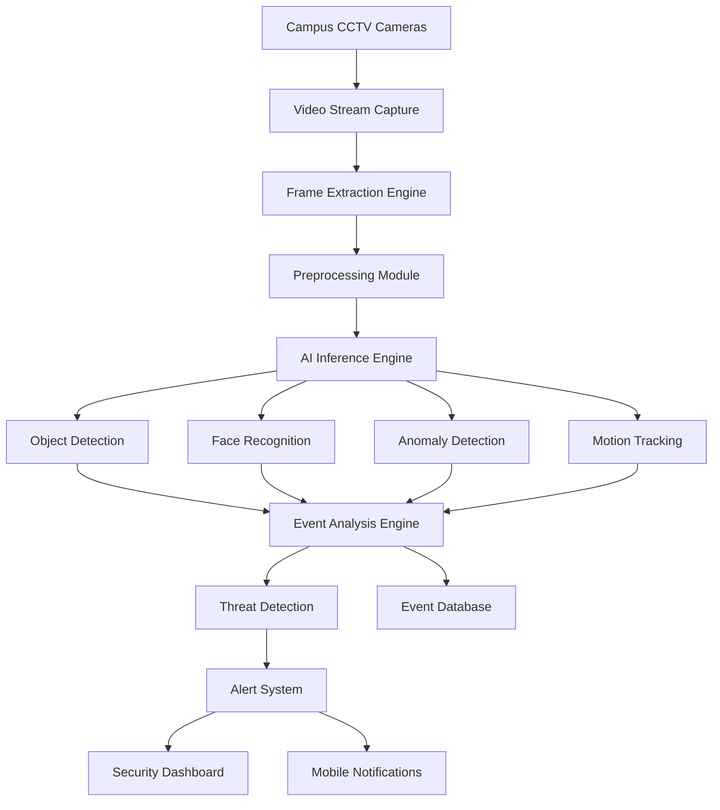

### Explanation

The VisionGuard AI architecture consists of multiple interconnected modules responsible for capturing video streams, analyzing frames using AI models, detecting security threats, and generating alerts.

The system begins with surveillance cameras capturing video streams across campus. These video streams are transmitted to the processing server where frames are extracted and preprocessed before being analyzed by deep learning models.

The AI inference engine performs several computer vision tasks such as object detection, face recognition, anomaly detection, and motion tracking. The outputs of these modules are aggregated in the event analysis engine, which determines whether the observed behavior represents a security risk.

If suspicious behavior is detected, the alert system sends notifications to the security dashboard and mobile devices of security personnel.

---

# 4. Data Flow Architecture

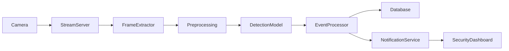

### Data Flow Explanation

The data pipeline of VisionGuard AI begins with video streams captured from surveillance cameras. These streams are transmitted to the stream server where frames are extracted at fixed intervals.

Each extracted frame undergoes preprocessing operations such as resizing, normalization, and noise reduction. The processed frames are then fed into the detection models which analyze the content and identify objects, faces, or suspicious activities.

The results of the AI inference are processed by the event processor which determines whether the event is a threat or normal activity. If an anomaly is detected, the system triggers alerts and stores event data in the database.

---

# 5. AI Model Architecture

The core intelligence of VisionGuard AI is built using deep learning models capable of analyzing complex visual patterns in surveillance footage.

The AI pipeline typically includes the following models:

* Object Detection Model
* Face Recognition Model
* Motion Detection Model
* Anomaly Detection Model

---

# 6. Object Detection Module Architecture

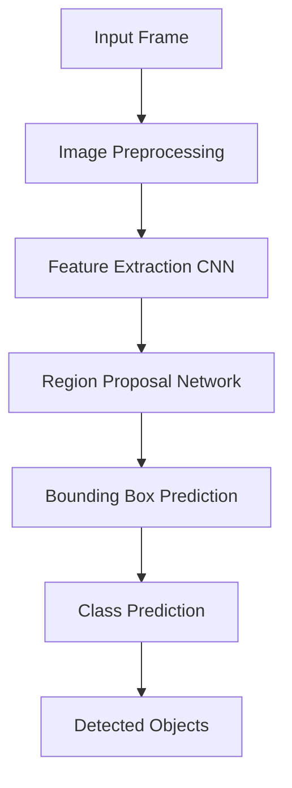

### Explanation

The object detection module identifies entities such as people, vehicles, bags, or other objects within surveillance footage. The system uses convolutional neural networks to extract spatial features from frames.

These features are processed by region proposal networks which predict potential bounding boxes for objects. The bounding boxes are then classified to identify the type of object detected.

---

# 7. Face Recognition Pipeline

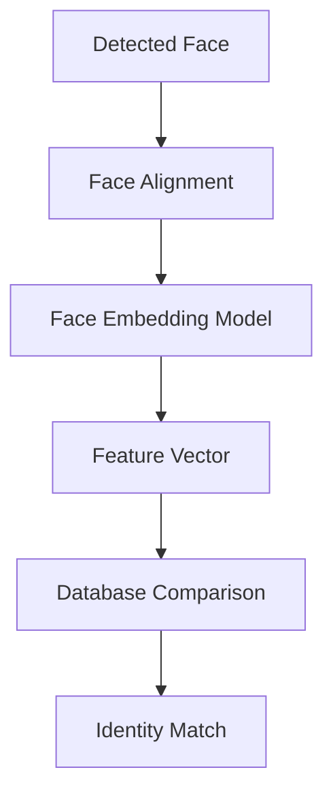

### Explanation

Face recognition allows the system to identify known individuals within the campus. When a face is detected in the frame, it undergoes alignment to normalize orientation.

The aligned face is then processed by a face embedding model that converts it into a numerical feature vector. This vector is compared against stored embeddings in the database to identify the individual.

---

# 8. Anomaly Detection Module

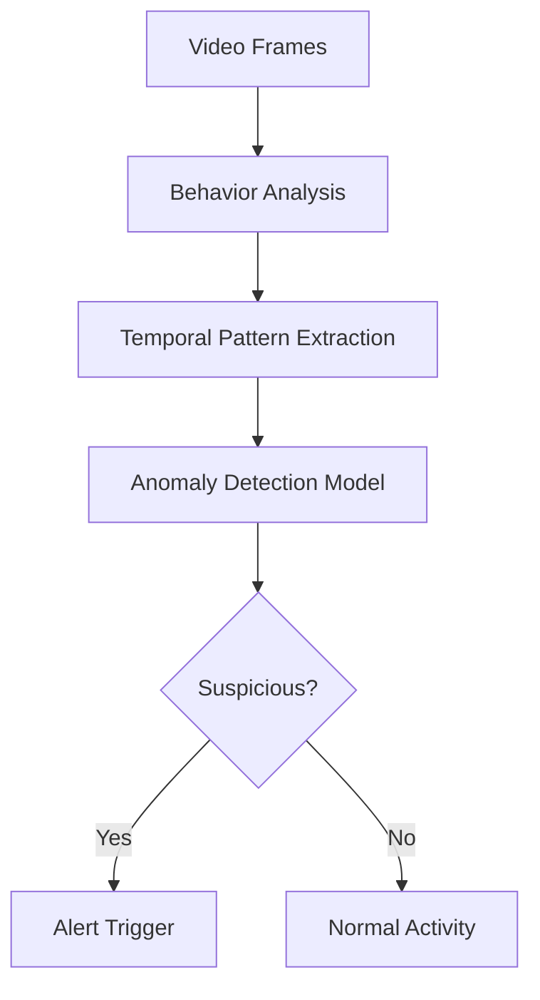

### Explanation

Anomaly detection models analyze patterns of human behavior over time. These models detect unusual events such as:

* Unauthorized entry
* Suspicious movement
* Loitering
* Aggressive behavior

If abnormal patterns are detected, the system flags the activity and generates alerts.

---

# 9. Alert Generation System

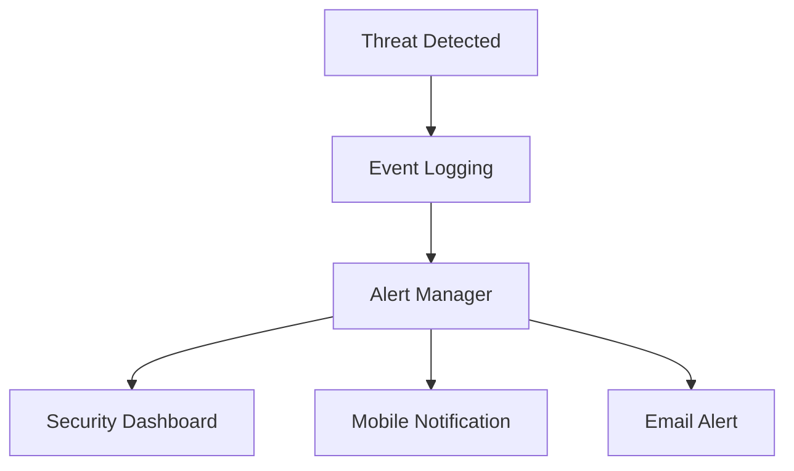

### Explanation

Once a threat is detected, the system generates alerts for security teams. The alert manager logs the event and distributes notifications through multiple channels such as dashboards, mobile devices, or emails.

This ensures rapid response to security incidents.

---
Below is the **additional section you should insert into your README** to integrate the **LAB Color Space / LAB Filter concept** into your VisionGuard AI project.
This will make the README **more research-grade and computer-vision focused** because LAB filtering is commonly used in **image preprocessing, segmentation, and illumination-robust detection**.

---

# 10. Technology Stack

| Component            | Technology           |
| -------------------- | -------------------- |
| Programming Language | Python               |
| Computer Vision      | OpenCV               |
| Deep Learning        | TensorFlow / PyTorch |
| Backend API          | Flask                |
| Database             | SQLite / PostgreSQL  |
| Streaming            | RTSP / IP Cameras    |
| Frontend             | Web Dashboard        |

These technologies allow VisionGuard AI to operate as a scalable surveillance system capable of processing real-time video streams efficiently. ([GitHub][1])

---

# 11. Key Features

* Real-time video surveillance
* AI-based human detection
* Facial recognition system
* Suspicious activity detection
* Real-time alert system
* Event logging and analytics
* Security monitoring dashboard
* Scalable multi-camera support

AI surveillance systems are increasingly used to automate monitoring tasks and improve situational awareness in large environments such as campuses and smart cities. ([arXiv][2])

---

# 12. Applications

VisionGuard AI can be deployed in several real-world scenarios including:

* University campus security
* Smart city monitoring
* Public transportation safety
* Airport surveillance
* Corporate office monitoring
* Industrial facility security

---

# 13 LAB Filter Processing Module

## Overview

The **LAB Filter module** in VisionGuard AI provides a collection of real-time image processing filters used to analyze surveillance video streams. These filters help security analysts visualize different aspects of video data such as edges, thermal-like signatures, color inversions, and structural patterns.

Image filtering techniques modify pixel values to enhance certain visual characteristics such as edges, contrast, shapes, or color patterns. This allows computer vision systems to highlight important information while suppressing irrelevant details. ([OpenCV][1])

The filter lab serves two major purposes:

1. **Visual analytics for security operators**
2. **Preprocessing for computer vision algorithms**

---

# LAB Filter Architecture

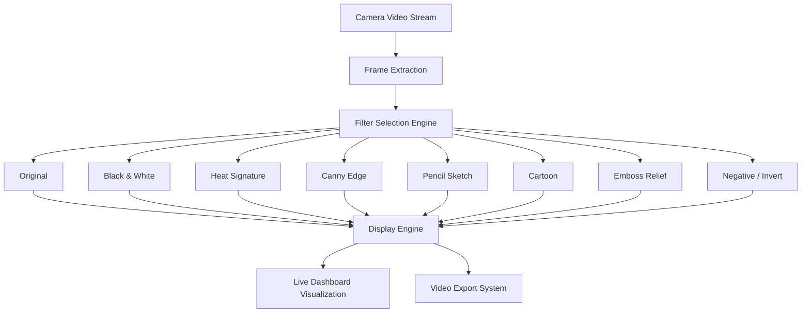

---

# Filter Processing Pipeline

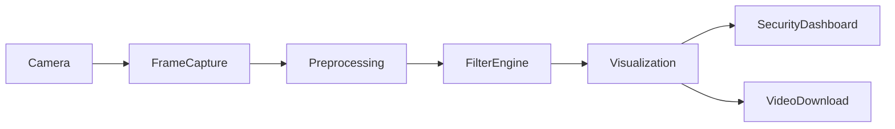

---

# Implemented Filters in VisionGuard AI

## 1. Original Filter

### Description

The original filter displays the raw video frame without any modifications. This mode preserves the full color information and is typically used for normal surveillance monitoring.

### Use Cases

* Real-time surveillance
* Visual verification of detected events
* Raw video export

---

# 2. Black & White Filter

### Description

The Black & White filter converts RGB images into grayscale images by removing color information and preserving intensity values.

### Benefits

* Reduces computational complexity
* Enhances contrast between objects
* Improves performance of some detection algorithms

### Algorithm Concept

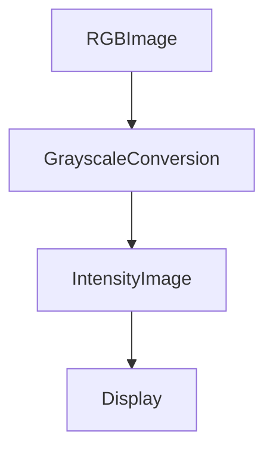

---

# 3. Heat Signature Filter

### Description

The Heat Signature filter simulates thermal vision by mapping pixel intensities into heatmap colors.

This transformation highlights regions with high brightness or motion activity using colors such as red, yellow, and blue.

### Applications

* Detecting movement in low light
* Highlighting human presence
* Monitoring suspicious activity

### Processing Flow

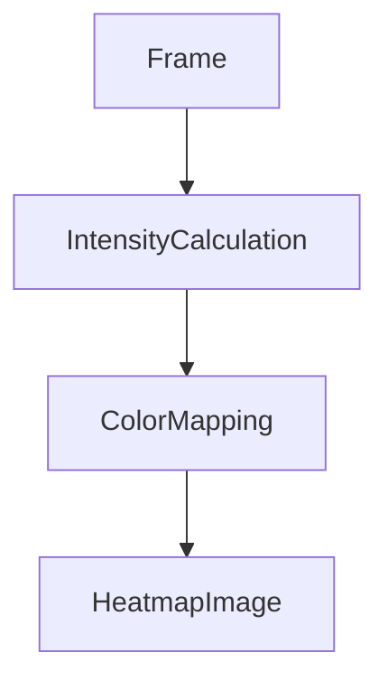

---

# 4. Canny Edge Filter

### Description

The Canny Edge filter extracts object boundaries by detecting sharp intensity changes between pixels. Edge detection helps identify the structural outline of objects within an image.

The Canny algorithm is a multi-stage edge detection technique widely used in computer vision pipelines. ([OpenCV Documentation][2])

### Processing Steps

1. Noise reduction using Gaussian filtering
2. Gradient intensity calculation
3. Non-maximum suppression
4. Edge tracking using hysteresis thresholds

### Edge Detection Architecture

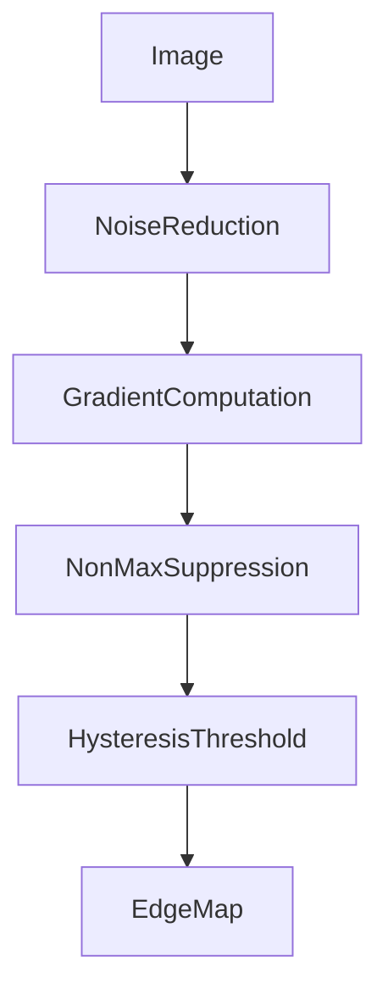

### Applications

* Object boundary detection
* Scene segmentation
* Structural feature extraction

---

# 5. Pencil Sketch Filter

### Description

The Pencil Sketch filter converts the video frame into a sketch-like drawing similar to a hand-drawn image.

This is achieved through:

* grayscale conversion
* edge detection
* inversion
* blending techniques

### Processing Pipeline

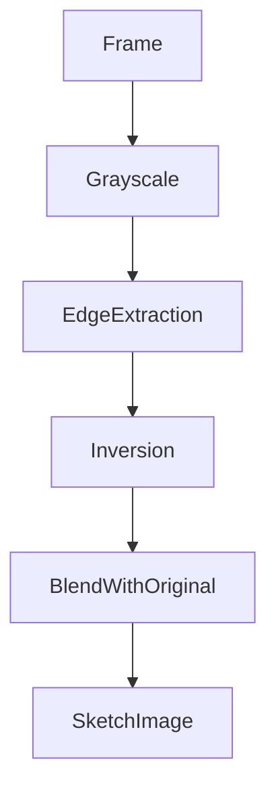

---

# 6. Cartoon Filter

### Description

The Cartoon filter transforms the video frame into a stylized cartoon-like representation by simplifying colors and emphasizing edges.

Cartoonization typically combines:

* bilateral filtering
* edge detection
* color quantization

Research shows cartoon effects are often created using edge detection and clustering techniques such as k-means to simplify color palettes. ([IJARSCT][3])

### Architecture

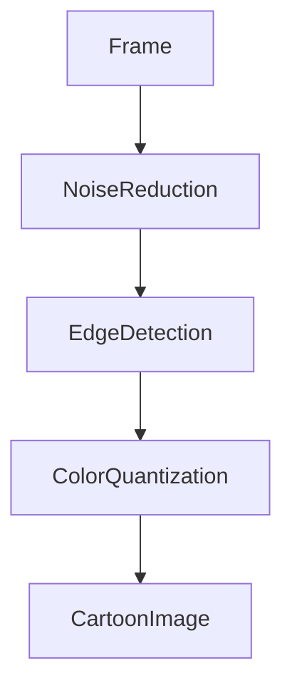

---

# 7. Emboss Relief Filter

### Description

The Emboss filter creates a 3D-like raised surface effect by highlighting intensity gradients between neighboring pixels.

### Processing Method

This effect is created by applying a convolution kernel that emphasizes directional intensity differences.

### Architecture

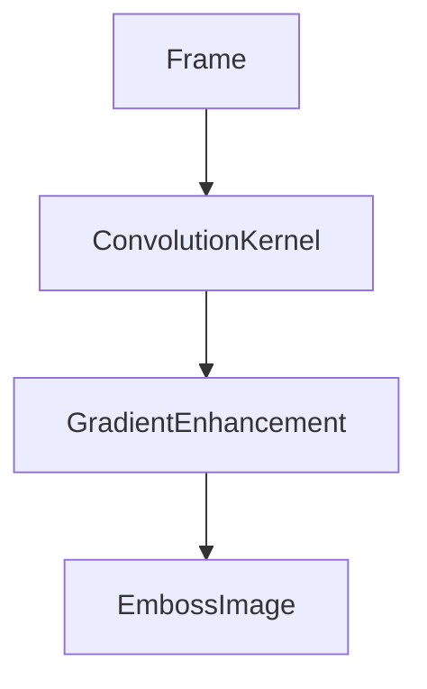

### Applications

* Texture analysis
* Visual pattern detection
* Artistic visualization

---

# 8. Negative / Invert Filter

### Description

The Negative filter inverts pixel values by transforming each pixel intensity according to:

```
New Pixel Value = 255 - Original Pixel Value
```

This produces a photographic negative effect where dark areas become bright and bright areas become dark.

### Processing Pipeline

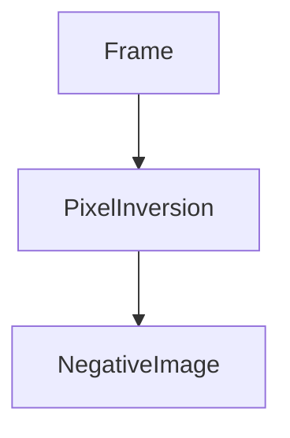

### Applications

* Highlight hidden patterns
* Improve visibility of certain objects
* Forensic image analysis

---

# Integration with VisionGuard AI

The Filter Lab module integrates with the VisionGuard pipeline as a visualization and preprocessing component.

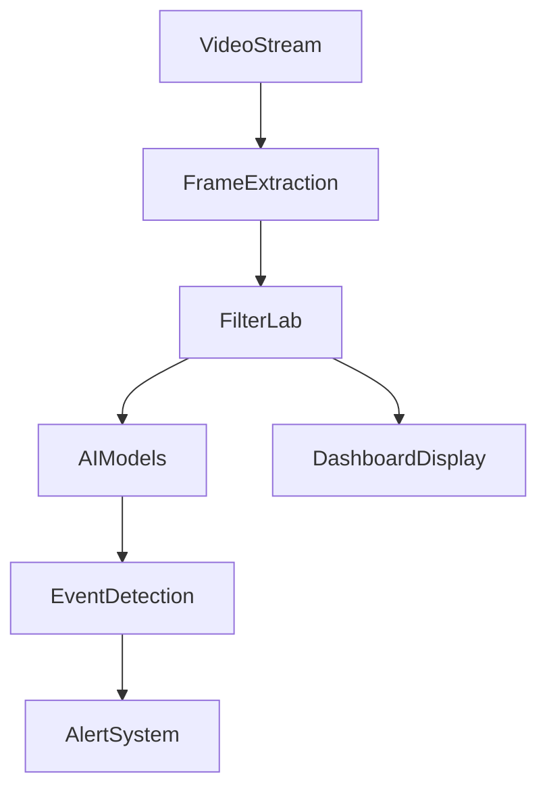

The filters can operate in two modes:

### 1. Visualization Mode

Filters are applied only for display purposes on the security dashboard.

### 2. Processing Mode

Filters preprocess frames before feeding them into AI detection models.

---

# Advantages of the Filter Lab System

| Feature               | Benefit                         |
| --------------------- | ------------------------------- |
| Real-time filtering   | Instant video transformation    |
| Multiple algorithms   | Supports diverse image analysis |
| Interactive selection | Security operator control       |
| Export capability     | Download processed videos       |

---

# 14. Conclusion

VisionGuard AI demonstrates how artificial intelligence can transform traditional surveillance systems into intelligent monitoring platforms. By integrating deep learning based visual recognition with real-time alert systems, the platform significantly enhances security infrastructure.

The modular architecture of the system allows it to scale across multiple surveillance environments while maintaining high detection accuracy and responsiveness.
The Filter Lab module significantly enhances the VisionGuard AI platform by providing flexible image processing capabilities. Through the integration of multiple computer vision filters such as edge detection, heat mapping, and artistic transformations, the system enables security personnel to visualize video data from multiple perspectives.

These filters also serve as preprocessing tools that can improve the effectiveness of AI detection models by emphasizing structural, color, and motion features within surveillance footage.

## Demo Images

Here are some visual demonstrations of the VisionGuard AI platform in action:


[1]: https://github.com/tharoosha/Vision_Guard_2?utm_source=chatgpt.com "tharoosha/Vision_Guard_2: Vision Guard: AI-powered ..."
[2]: https://arxiv.org/abs/2301.03561?utm_source=chatgpt.com "Ancilia: Scalable Intelligent Video Surveillance for the Artificial Intelligence of Things"
